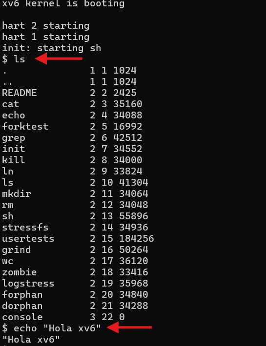
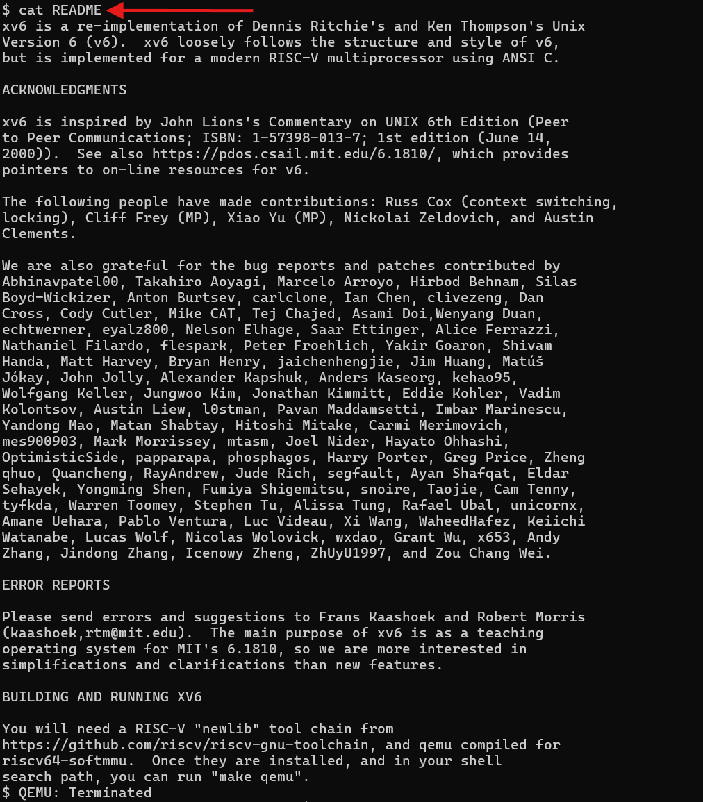

---------- Instalación de Ubuntu en WSL ----------

Descargué Ubuntu desde Microsoft Store

Al iniciar apareció este error:

WslRegisterDistribution failed with error: 0x80071772

Para arreglarlo ejecuté en PowerShell (modo administrador):

	cipher /d /s:"$env:LOCALAPPDATA\Microsoft\WindowsApps"
	cipher /d /s:"$env:LOCALAPPDATA\Packages"

Luego reinicié

Al volver a abrir Ubuntu el error ya no salía y terminé la configuración del ubuntu

---------- Clonación de xv6-riscv ----------

Desde mi cuenta de GitHub hice un fork al repositorio del mit:
https://github.com/mit-pdos/xv6-riscv

En ubuntu cloné mi fork con:

	git clone https://github.com/Dgomez-22/xv6-riscv

	cd xv6-riscv

---------- Creación de branch ----------

Creé un branch con:

	git checkout -b Diego_Gomez-Tomas_Poblete

---------- Make qemu y errores ----------

Al intentar correr el make:

	make qemu

Apareció el error de falta de dependencias

Intenté instalar dependencias (del ppt de la T0) con:

	sudo apt-get install make qemu-system-misc bc gcc-riscv64-linux-gnu

Pero no se descargaban porque faltaba actualizar unos paquetes

Para arreglarlo corrí:

	sudo apt update

Después pude instalar las dependencias (las que mencioné arriba) sin problemas

Luego de haber instalado las dependencias corrí nuevamente el:

	make qemu

Pero me salió otro problema:

	make: gcc: No such file or directory

De ahí me di cuenta que faltaba el gcc y las herramientas de compilación

Por lo tanto los descargué con:

	sudo apt install -y build-essential gdb-multiarch qemu-system-misc git

---------- Resultado final ----------

Después de instalar correctamente todas las dependencias corrí el make qemu y me salió bien

De ahí continué con la tarea y pude correr bien el:

	ls

	echo "Hola xv6"

	cat README

Aquí adjunto las fotos de esos comandos en xv6

1. Comandos ls y echo

2. Comando cat README

Con esto quedó instalado y funcionando xv6-riscv en WSL
